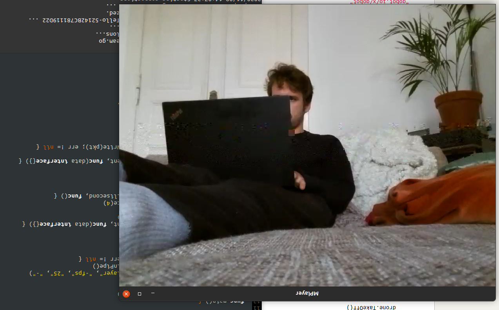
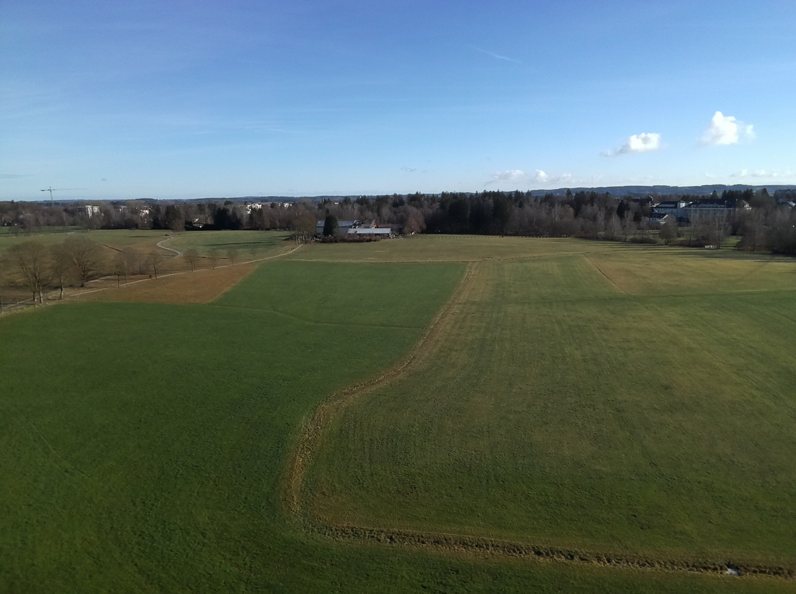
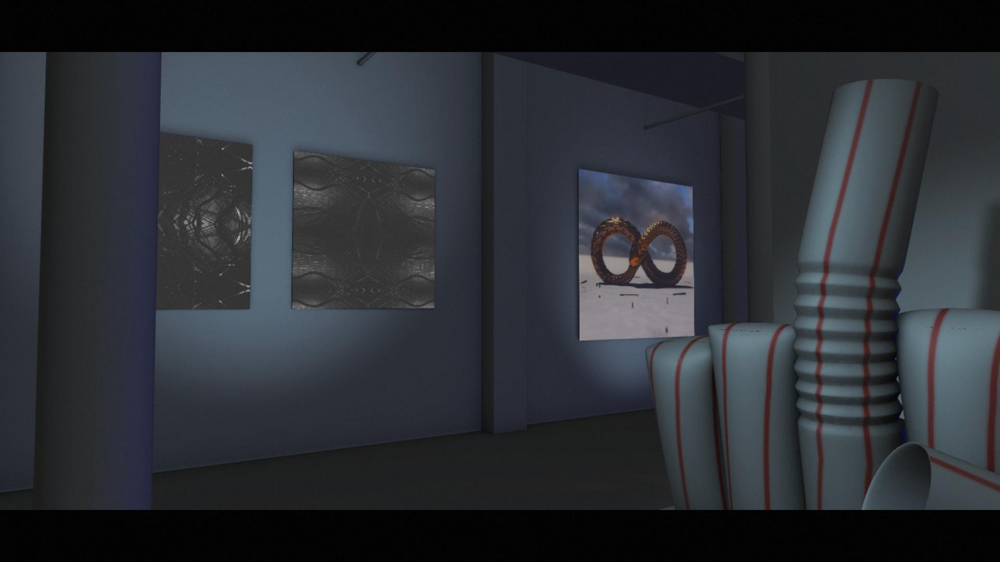
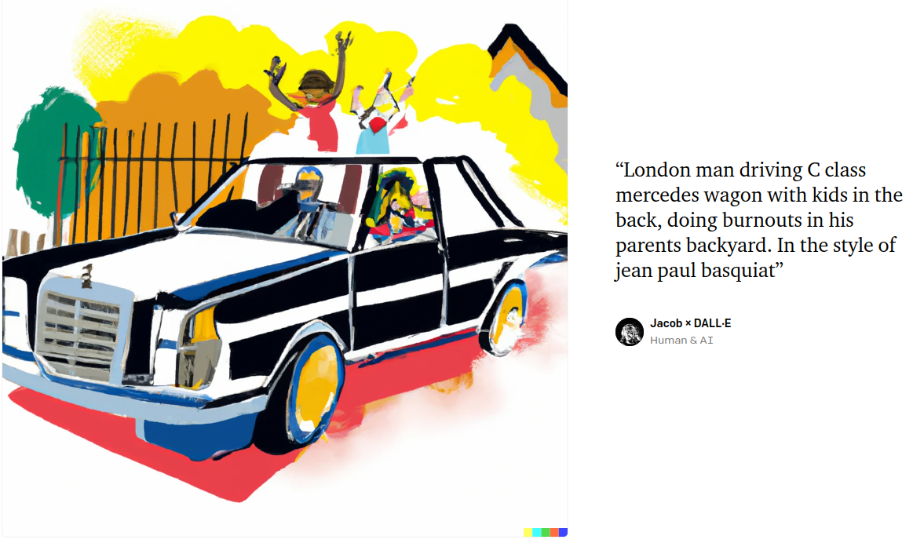
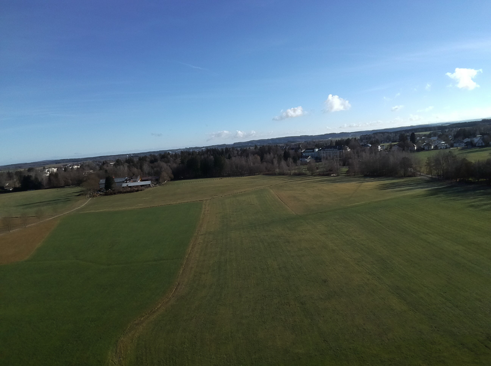
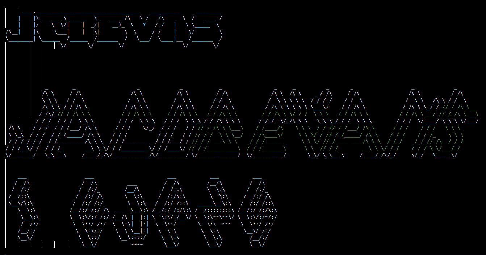
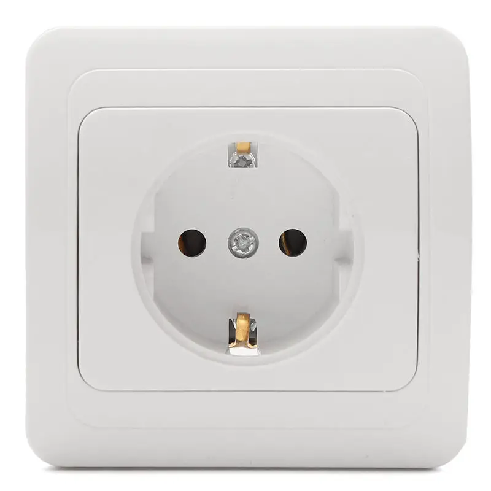
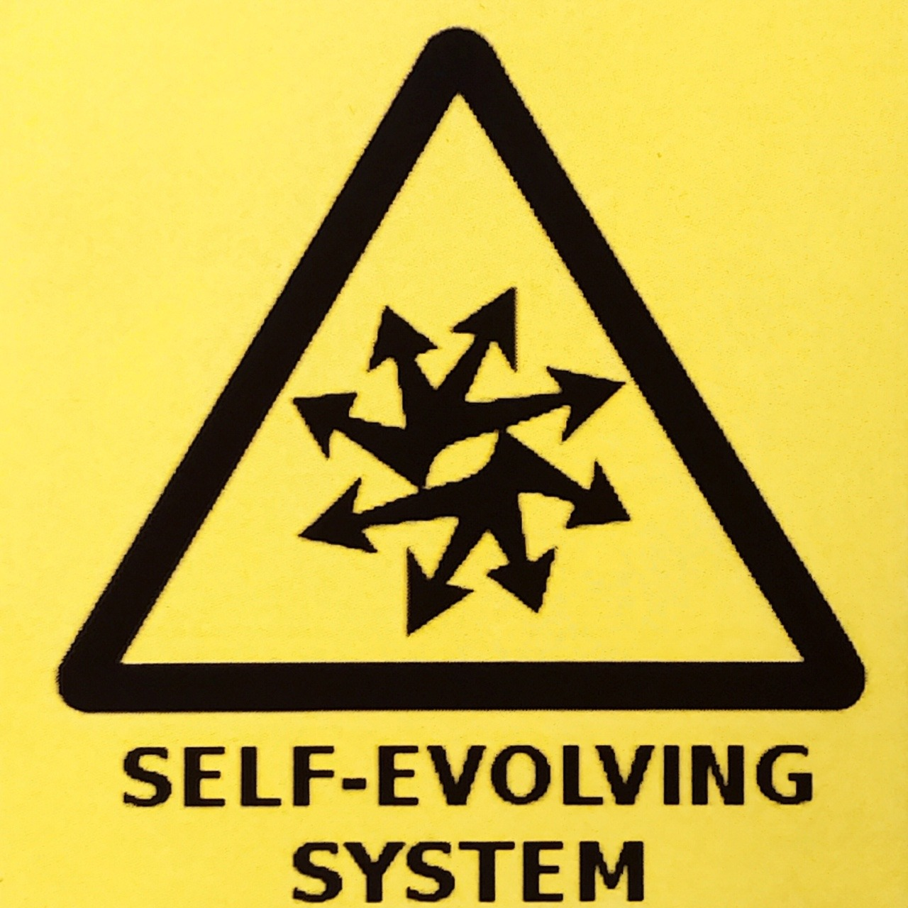
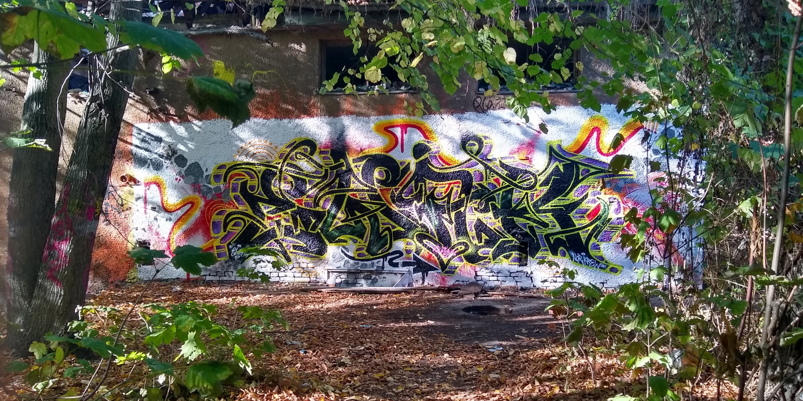
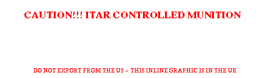

# curated

`# curated` intends to be a list of sites/songs/photos/content that ...


# 🧠 BR(AI)NS 🧠

```
br(AI)ns 🧠🧠
```

[](https://youtu.be/E6_CZUbi-CM)

---

```
  ____  _____ _____ _   _  ____                         _       ____  _____ _____ _   _  ____   _                              ____ _   _ _____ _____ ____  
 | __ )| ____| ____| \ | |/ ___|   __ _ _ __   ___  ___| |__   | __ )| ____| ____| \ | |/ ___| | |__   ___  ___ _ __   __ _   / ___| \ | | ____| ____| __ ) 
 |  _ \|  _| |  _| |  \| | |  _   / _` | '_ \ / _ \/ _ \ '_ \  |  _ \|  _| |  _| |  \| | |  _  | '_ \ / _ \/ _ \ '_ \ / _` | | |  _|  \| |  _| |  _| |  _ \ 
 | |_) | |___| |___| |\  | |_| | | (_| | | | |  __/  __/ |_) | | |_) | |___| |___| |\  | |_| | | |_) |  __/  __/ | | | (_| | | |_| | |\  | |___| |___| |_) |
 |____/|_____|_____|_| \_|\____|  \__, |_| |_|\___|\___|_.__/  |____/|_____|_____|_| \_|\____| |_.__/ \___|\___|_| |_|\__, |  \____|_| \_|_____|_____|____/ 
                                  |___/                                                                               |___/                                 
                                
```




















[side_plate.pdf](mine/side_plate.pdf)
[mazzer_hopper_bellows.stl](mine/mazzer_hopper_bellows.stl)
[wavy_surface.stl](mine/wavy_surface.stl)

# //TODO

 ~~Do I need a menu here?~~

-[x]  How to create a list in .md format? 

-[x]  Publish this to a GH pages branch 

-[x]  Save photos and images from collection

-[] Remove non licensed stuff


-[] 


